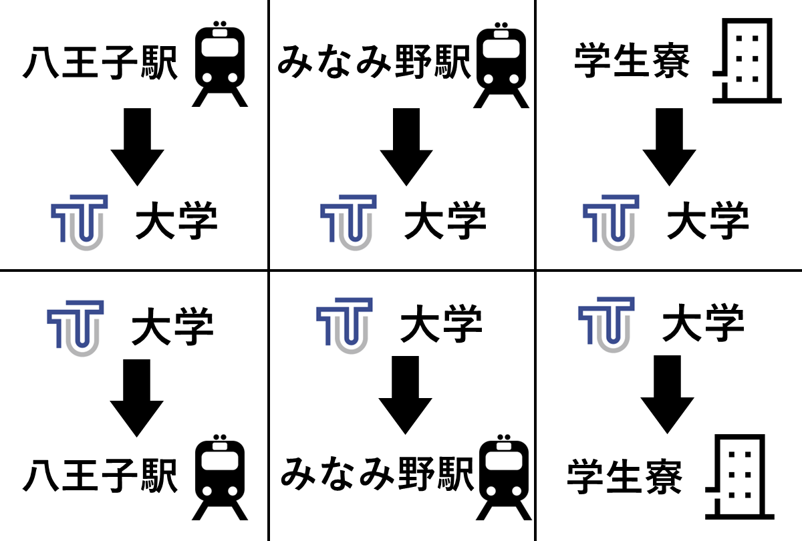

# TUT Bus Bot
TUT Bus Botは東京工科大学・八王子専門学校のスクールバス時刻を取得することができます。

## 使い方
### 友達追加
以下のQRコードを利用して `TUT Bus Bot` のアカウントを追加してください。

### バス時刻表取得
トーク画面を開くと以下の様なメニューが表示されるので取得したいバス種別を選択してください。
タップすると直近5本のバス発車時刻を取得することができます。

|LINE追加用 QRコード|バス種別選択イメージ画像|
|---|---|
|||


## お問い合わせ
本プログラムは個人で開発したものであり，東京工科大学・日本工学院専門学校及びバス運行元への問い合わせは行わないでください．
不明点・問い合わせなどがあれば以下のメールアドレスにお送りください
```
4kin0ri.dev@gmail.com
```
